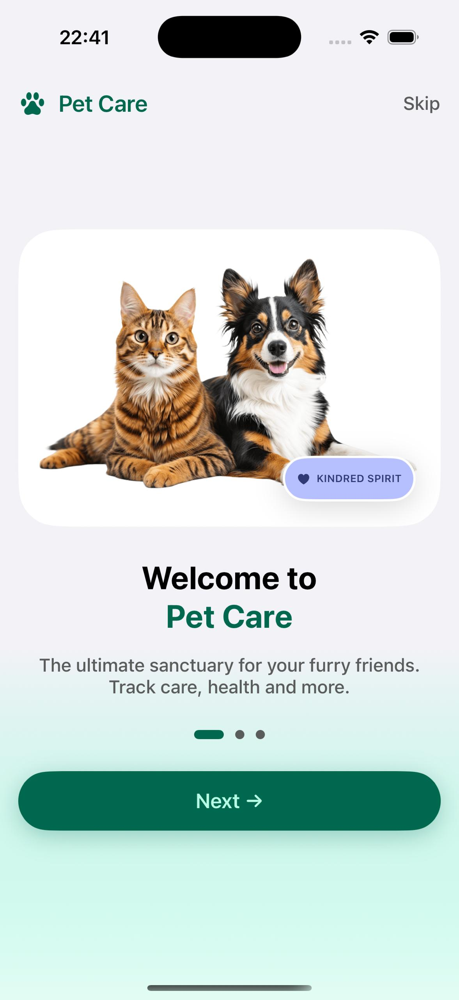
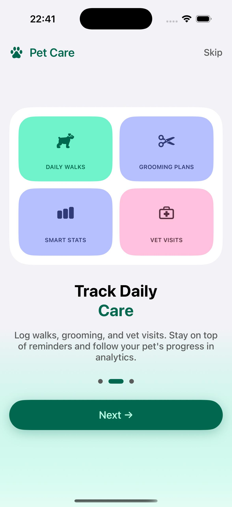
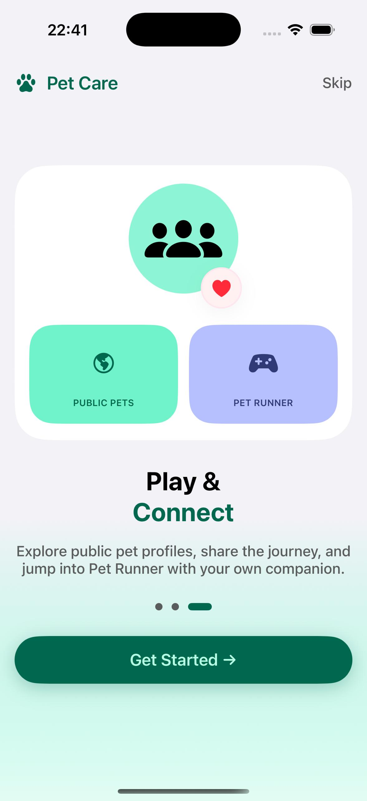
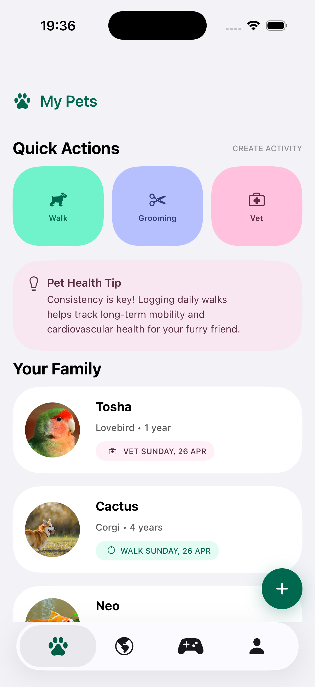
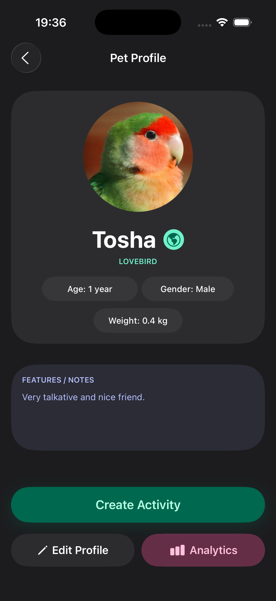
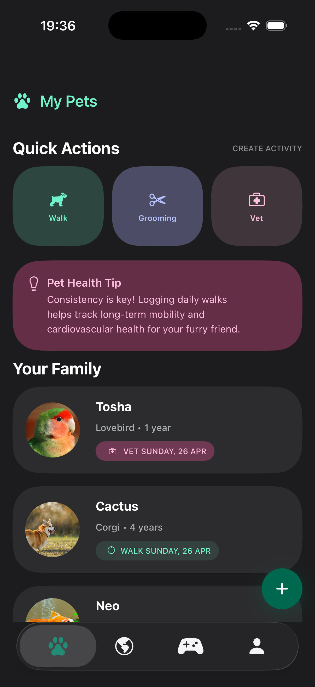
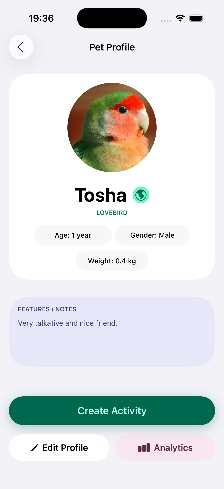
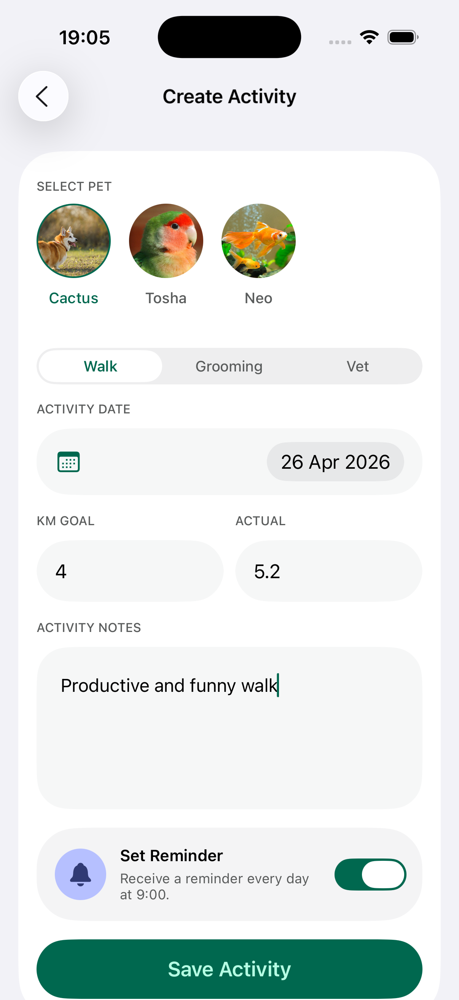
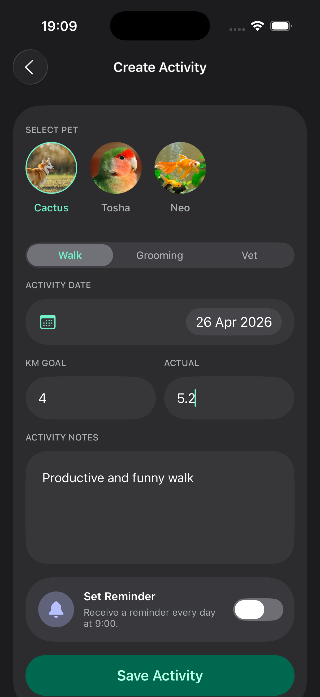
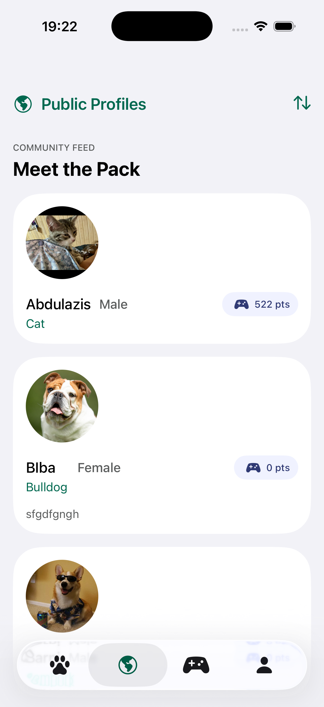

# Pet Care

  
  &nbsp;
  
  &nbsp;
  

## About

Pet Care is a modern iOS application for pet owners who want to keep their pets’ information, care routines, health events, reminders, and activity statistics organized in one place.

The app combines profile management, activity tracking, analytics, public pet profiles, notifications, and a playful mini-game to create a useful and engaging pet care experience.

## Core Features

- Authentication with email/password and Google Sign-In
- Multiple pet profile management
- Detailed pet cards with photo, breed, birth date, gender, weight, and notes
- Daily care tracking for walks, grooming, and vet visits
- Reminder notifications for grooming and veterinary appointments
- Activity analytics with history, goals, and period filters
- Public pet profiles for browsing other pets
- Interactive mini-game featuring the user’s pet
- User profile editing and app settings

## App Screens

### Pet Management

Users can create and manage multiple pet profiles, store important details, and quickly access each pet’s care history.

   &nbsp;
   &nbsp;
   &nbsp;
  

### Activity Tracking

Pet Care allows users to record daily care activities such as walks, grooming sessions, and vet visits.

  
  

### Analytics

The analytics screen helps users understand their pet’s activity and care routine through statistics, progress tracking, latest care events, and time-based filters.

  

### Public Profiles

Users can explore public pet profiles and view shared pet information in a clean, social-style interface.

  
  
  

### Mini-Game

The app includes a simple mini-game where the user’s pet becomes the main character, adding a playful and engaging part to the experience.

  

### Profile and Settings

Users can manage their personal profile and adjust app preferences from dedicated profile and settings screens.

  

## Analytics

The analytics module provides an overview of the pet’s activity and care history, including:

- Step statistics
- Walk history
- Goal progress
- Latest grooming session
- Latest vet visit
- Activity history
- Period-based filters

## Notifications

Pet Care uses local notifications to help users stay on top of important care events. Users can set reminders for grooming and veterinary appointments with custom intervals.

## Tech Stack

- UIKit
- Firebase
- SwiftData
- UserNotifications
- SwiftLint
- SwiftGen
- Swift Package Manager

## Future Improvements

- AI-based pet care recommendations
- Comments on public pet profiles
- Achievements and rewards
- Premium features
- Advanced analytics
- More mini-games
- Expanded social features

## Project Goal

The goal of Pet Care is to provide pet owners with a polished, convenient, and engaging mobile app for managing pet information, tracking care routines, monitoring activity, and staying connected with their pets every day.
