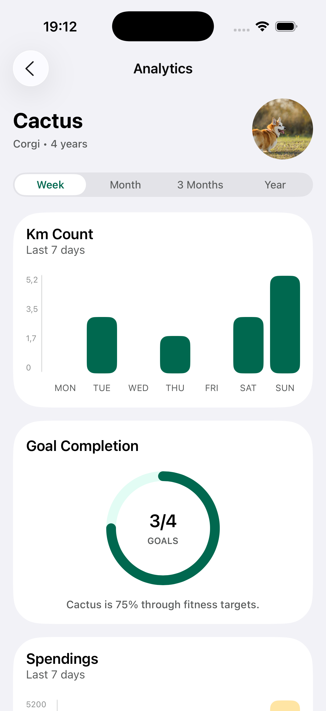
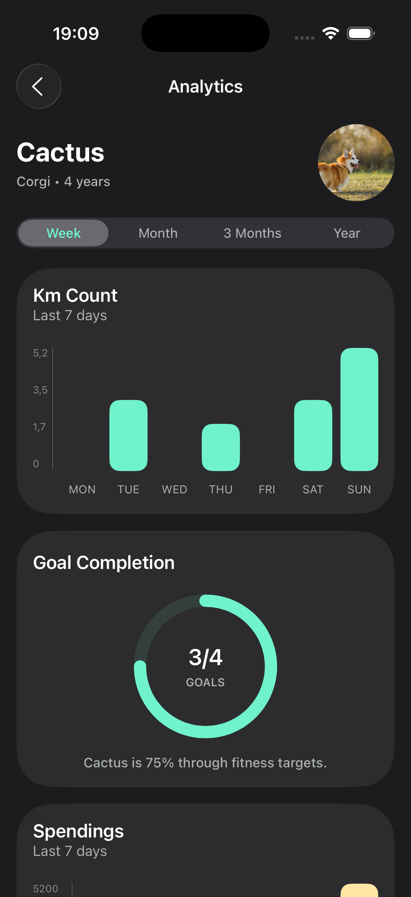
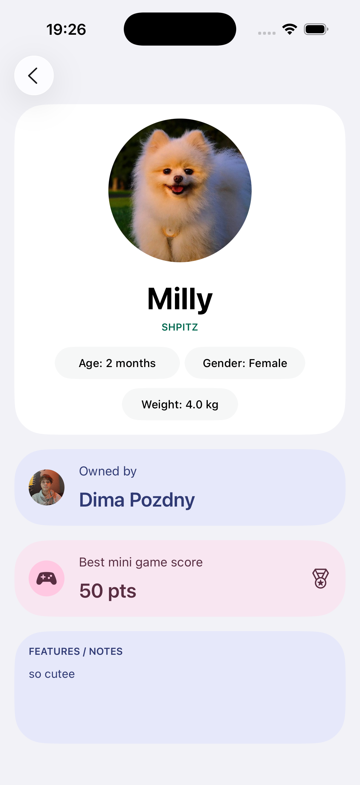
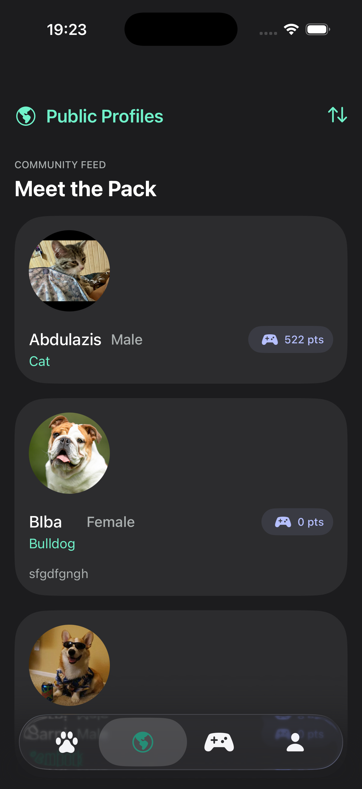
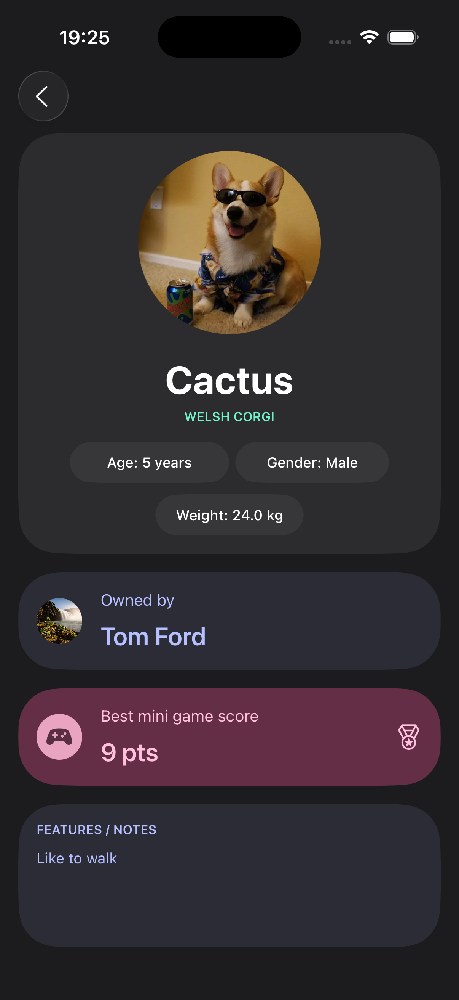

# Pet Care

  
  &nbsp;
  
  &nbsp;
  

## About

Pet Care is a modern iOS application created for pet owners who want to keep their pets’ information, daily routines, health events, reminders, and activity statistics organized in one place.

The app brings together pet profile management, care activity tracking, analytics, public pet profiles, notifications, and a playful mini-game. It is designed to make everyday pet care easier, more structured, and more engaging.

Users can manage several pets, store important details, track walks, grooming sessions, and vet visits, monitor progress through analytics, and receive reminders for important care events.

## Core Features

- Sign up and log in with email/password or Google Sign-In
- Create and manage multiple pet profiles
- Add detailed pet information, including photo, name, breed, birth date, gender, weight, and notes
- Track daily care activities such as walks, grooming, and veterinary visits
- View activity history and care statistics
- Monitor goal progress and recent care events
- Set reminders for grooming and vet appointments
- Receive local notifications for important pet care tasks
- Explore public profiles of other pets
- View detailed public pet pages
- Play a mini-game with the user’s pet as the main character
- Edit user profile information
- Manage app preferences and settings
- Use the app in both light and dark modes

## App Screens

### Pet Management

Users can create and manage multiple pet profiles, store important details, and quickly access each pet’s care history. Each profile contains key information that helps owners keep all pet-related data structured and easy to update.

   &nbsp;
    
   &nbsp;
  

### Activity Tracking

Pet Care allows users to record daily care activities such as walks, grooming sessions, and vet visits. This helps users maintain a consistent care routine and keep track of completed activities over time.

  
  

### Analytics

The analytics screen helps users understand their pet’s activity and care routine through statistics, progress tracking, latest care events, and time-based filters. It provides a clear overview of activity history and helps users monitor how consistently care tasks are completed.

  
  

### Public Profiles

Users can explore public pet profiles and view shared pet information in a clean, social-style interface. This feature adds a community element to the app and allows users to discover other pets.

   &nbsp;
   
   &nbsp;
  

### Mini-Game

The app includes a simple mini-game where the user’s pet becomes the main character. This adds a playful and engaging part to the experience, making the app feel more personal and interactive.

  

### Profile and Settings

Users can manage their personal profile and adjust app preferences from dedicated profile and settings screens. These screens provide access to account information, app configuration, and personalization options.

  

## Authentication

Pet Care supports user authentication with email/password and Google Sign-In. This allows users to securely access their personal pet data and keep their profiles connected to their account.

## Pet Profiles

Each pet profile stores important information about the animal, including:

- Photo
- Name
- Breed
- Birth date
- Gender
- Weight
- Notes

This makes the app useful as a personal pet database where users can keep essential details in one place.

## Care Activities

Users can create and track different care activities, including:

- Walks
- Grooming
- Vet visits

Activity tracking helps users build a clear history of their pet’s care routine and review completed tasks later.

## Analytics

The analytics module provides an overview of the pet’s activity and care history, including:

- Step statistics
- Walk history
- Goal progress
- Latest grooming session
- Latest vet visit
- Activity history
- Period-based filters

## Notifications

Pet Care uses local notifications to help users stay on top of important care events. Users can set reminders for grooming and veterinary appointments with custom intervals, helping them avoid missing regular care tasks.

## Tech Stack

- UIKit
- Firebase
- SwiftData
- UserNotifications
- SwiftLint
- SwiftGen
- Swift Package Manager

## Future Improvements

- AI-based pet care recommendations
- Comments on public pet profiles
- Achievements and rewards
- Premium features
- Advanced analytics
- More mini-games
- Expanded social features

## Project Goal

The goal of Pet Care is to provide pet owners with a polished, convenient, and engaging mobile app for managing pet information, tracking daily care routines, monitoring activity, receiving reminders, and staying connected with their pets every day.

The project focuses on combining practical pet care tools with a clean visual design, smooth user experience, and interactive features that make the app both useful and enjoyable.
